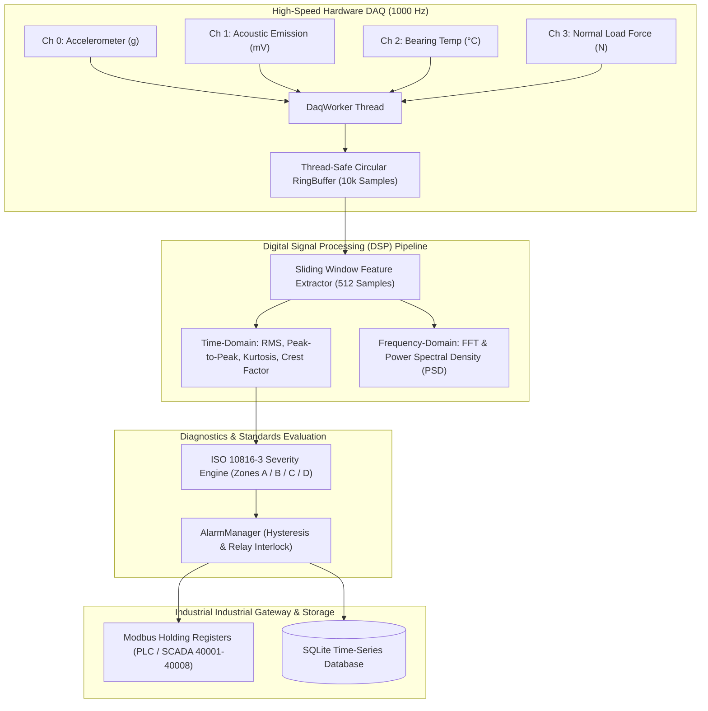

# 📡 EdgeVibe-Pro — Industrial Multi-Sensor Edge DAQ & Predictive Condition Monitoring Engine

[](https://python.org)
[](https://www.iso.org/standard/43209.html)
[](https://modbus.org)
[](https://pytest.org)

An enterprise-grade **Industrial Edge Data Acquisition (DAQ) and Condition Monitoring Platform** designed for high-speed rotating machinery, tribological test benches, and predictive maintenance. Compliant with **ISO 10816-3** vibration severity standards.

---

## 🏛️ System Architecture



---

## 🌟 Key Capabilities

1. **Zero-Copy High-Throughput Streaming:**
   * Multi-threaded asynchronous sensor ingestion running at $1000\text{ Hz}$.
   * Lock-managed circular **RingBuffer** eliminating memory allocation spikes and sample drops during continuous acquisition.

2. **Digital Signal Processing (DSP) Engine:**
   * **RMS Velocity ($\text{mm/s}$):** Direct correlation with overall machine vibrational energy.
   * **Kurtosis:** Normalized 4th central moment ($> 3.0$ indicates repetitive impulsive shock waves characteristic of early-stage bearing inner/outer race spalling).
   * **Crest Factor:** Ratio of peak amplitude to RMS ($C = \frac{x_{\text{peak}}}{x_{\text{rms}}}$).
   * **Fast Fourier Transform (FFT):** Identifies fundamental shaft rotational speed ($1\times$), mechanical misalignment ($2\times$), and Ball Pass Frequency Inner race ($\text{BPFI}$).

3. **ISO 10816-3 Mechanical Vibration Severity Standard:**
   * **Zone A (Green, $< 1.4\text{ mm/s}$):** Newly commissioned machines; optimal baseline condition.
   * **Zone B (Cyan, $1.4 - 2.8\text{ mm/s}$):** Acceptable for continuous unrestricted operation.
   * **Zone C (Amber, $2.8 - 4.5\text{ mm/s}$):** Unsatisfactory; requires scheduled maintenance.
   * **Zone D (Red, $> 4.5\text{ mm/s}$):** Critical damage risk; emergency trip signal opened.

4. **Industrial Automation Gateway:**
   * Live mapping of vibration features, bearing temperatures, and trip bits into **Modbus Holding Registers (40001 – 40008)** for PLC/SCADA and DCS integration.
   * Automated time-series persistence into SQLite database (`edgevibe_telemetry.db`).

---

## 📂 Project Structure

```
EdgeVibe-Pro/
├── edge_vibe/
│   ├── daq/                  # High-speed Data Acquisition
│   │   ├── ring_buffer.py    # Thread-safe Circular Buffer
│   │   ├── sim_channels.py   # Industrial Rotating Machinery Sensor Generator
│   │   └── acquisition.py    # Asynchronous DAQ Worker Thread
│   ├── dsp/                  # Digital Signal Processing
│   │   ├── features.py       # Time-Domain Metrics (RMS, Kurtosis, Crest Factor)
│   │   └── spectral.py       # FFT, Power Spectral Density, Peak Detection
│   ├── diagnostics/          # Standards & Threshold Engines
│   │   ├── iso10816.py       # ISO 10816-3 Vibration Severity Classification
│   │   └── alarm_manager.py  # Hysteresis Thresholds & Emergency Interlocks
│   └── gateway/              # SCADA & Industrial Fieldbus
│       ├── modbus_publisher.py # Modbus Holding Register Mapping (40001-40008)
│       └── logger.py         # SQLite Time-Series Database Manager
├── tests/                    # Unit Tests
│   ├── test_dsp.py
│   └── test_ring_buffer.py
├── run_edgevibe.py           # Real-Time Telemetry Daemon
└── README.md
```

---

## 🚀 Quick Start

1. **Clone the repository:**
   ```bash
   git clone https://github.com/kiran10299/EdgeVibe-Pro.git
   cd EdgeVibe-Pro
   ```

2. **Run the Condition Monitoring Daemon:**
   ```bash
   python run_edgevibe.py
   ```

3. **Run Unit Tests:**
   ```bash
   python -m pytest tests/
   ```

---

## 📟 Modbus Register Map (PLC / SCADA Interface)

| Register | Address (Offset) | Signal Description | Scaling / Format |
| :--- | :--- | :--- | :--- |
| **40001** | `0` | Vibration Velocity RMS | $\text{Value} \times 100 \quad [\text{mm/s}]$ |
| **40002** | `1` | Vibration Peak-to-Peak | $\text{Value} \times 100 \quad [\text{mm/s}]$ |
| **40003** | `2` | Bearing Impulsive Kurtosis | $\text{Value} \times 10$ |
| **40004** | `3` | Crest Factor | $\text{Value} \times 10$ |
| **40005** | `4` | Dominant FFT Peak Frequency | $\text{Integer} \quad [\text{Hz}]$ |
| **40006** | `5` | Bearing Temperature | $\text{Value} \times 10 \quad [^\circ\text{C}]$ |
| **40007** | `6` | Normal Tribology Load Force | $\text{Integer} \quad [\text{N}]$ |
| **40008** | `7` | Alarm Status Bitmask | Bit 0: Warning \| Bit 1: Trip \| Bit 2: Relay Open |

---

## 👨‍💻 Author

**Kiran Shivakumar**  
*Application Engineer | LabVIEW, Test & Measurement & Robotics*  
* 🌐 **Portfolio Website:** [kiran10299.github.io](https://kiran10299.github.io)  
* 💼 **LinkedIn:** [linkedin.com/in/kiranshivakumar](https://www.linkedin.com/in/kiranshivakumar)  
* 🐙 **GitHub:** [@kiran10299](https://github.com/kiran10299)
